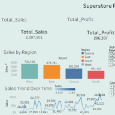

# Retail Sales Analytics – Business Intelligence Dashboard (Tableau)

Analyzing retail sales, profit, and regional performance across the US Superstore business to identify where profitability is breaking down and support smarter purchasing, discounting, and inventory decisions using Tableau.

## Table of Contents
- [Overview](#overview)
- [Business Problem](#business-problem)
- [Dataset](#dataset)
- [Tools & Technologies](#tools--technologies)
- [Project Structure](#project-structure)
- [Data Preparation](#data-preparation)
- [Key Metrics at a Glance](#key-metrics-at-a-glance)
- [Analysis & Key Findings](#analysis--key-findings)
- [Dashboard](#dashboard)
- [How to Run This Project](#how-to-run-this-project)
- [Results & Recommendations](#results--recommendations)
- [Future Work](#future-work)
- [Author & Contact](#author--contact)

## Overview
This project evaluates Superstore's sales and profitability performance across regions, states, categories, sub-categories, and customers between 2014 and 2017. Using Tableau, the raw transactional data was transformed into an interactive dashboard that surfaces not just *how much* the business is selling, but *where it's actually making money* — and where high sales volume is quietly masking a loss.

The dashboard is built to be usable by a non-technical stakeholder: someone in leadership should be able to open it, filter by region or category, and walk away with a clear answer to "where should we focus next quarter."

## Business Problem
Superstore's total revenue has grown every year in the dataset — but profit has not scaled at the same rate. A category or region can look successful on a top-line sales report while actually eroding margin once discounts, returns, and cost-to-serve are factored in. Leadership needed answers to three things:

1. Which categories and sub-categories are genuinely profitable, versus which ones just generate volume?
2. Is the company's discounting strategy helping close sales, or actively destroying margin?
3. Which regions and states need a pricing/operations review because sales aren't converting into profit?

This project was built to answer those three questions with data instead of assumption.

## Dataset
- **Source:** Sample Superstore dataset (`data/superstore_dataset.xls`)
- **Sheets:** `Orders`, `Returns`, `People`
- **Size:** 9,994 order-line records
- **Coverage:** 793 unique customers · 49 states · 4 regions · 3 categories · 17 sub-categories
- **Timeframe:** 2014–2017

**Key columns used from the `Orders` sheet:**
| Column | Description |
|---|---|
| Order ID / Order Date / Ship Date | Order-level identifiers and timing |
| Customer ID / Customer Name / Segment | Who placed the order |
| Region / State / City | Where the order shipped |
| Category / Sub-Category / Product Name | What was sold |
| Sales / Quantity / Discount / Profit | The core numbers this analysis is built on |

## Tools & Technologies
- **Tableau Desktop** — data modeling, calculated fields, dashboard build
- **Excel (.xls)** — source data format

## Project Structure
```
retail-sales-analytics-tableau/
├── data/
│   └── superstore_dataset.xls        # Raw source data (Orders, Returns, People)
├── dashboards/
│   └── retail_sales_dashboard.twbx   # Tableau packaged workbook
├── images/
│   └── dashboard_preview.png         # Dashboard screenshot
├── README.md
└── .gitignore
```

## Data Preparation
Before analysis, the following was done in Tableau directly on the connected data source:

- Verified data types on Order Date / Ship Date (date), Sales / Profit / Discount (numeric), and Region / Category / Sub-Category (dimension/string).
- Checked for and confirmed no null values in the core measures (Sales, Profit, Quantity, Discount).
- Built six calculated fields to support deeper analysis beyond the raw columns:

| Calculated Field | Formula | Purpose |
|---|---|---|
| Profit Margin % | `[Profit] / [Sales] * 100` | Normalize profitability across categories of different sizes |
| Profitability Status | `IF [Profit] > 0 THEN "Profitable" ELSE "Loss Making" END` | Quickly flag losing product lines |
| Discount Tier | No / Low (≤20%) / Medium (≤50%) / High Discount | Bucket orders to test discount impact |
| Sales per Unit | `[Sales] / [Quantity]` | Normalize sales at the unit level |
| Profit per Unit | `[Profit] / [Quantity]` | Normalize profit at the unit level |
| Order Value Tier | High Value (Sales ≥ 500) vs Regular | Separate large orders from routine ones |

## Key Metrics at a Glance
| Metric | Value |
|---|---|
| Total Sales | $2,297,201 |
| Total Profit | $286,397 |
| Overall Profit Margin | 12.5% |
| Total Orders | 5,009 |
| Total Customers | 793 |
| Average Order Value | $458.61 |
| Standard Class Share of Orders | ~60% |

## Analysis & Key Findings

**By Category**
| Category | Sales | Profit | Margin % |
|---|---|---|---|
| Technology | $836,154 | $145,455 | 17.40% |
| Furniture | $742,000 | $18,451 | 2.49% |
| Office Supplies | $719,047 | $122,491 | 17.04% |

Furniture generates almost as much revenue as Technology but converts almost none of it to profit — this is the single biggest profitability gap in the dataset.

**By Sub-Category**
- Most profitable: Copiers ($55.6K), Phones ($44.5K), Accessories ($41.9K), Paper ($34.1K), Binders ($30.2K)
- Losing money outright: Tables (**-$17.7K**), Bookcases (**-$3.5K**), Supplies (**-$1.2K**)

**By Region**
| Region | Sales | Profit | Margin % |
|---|---|---|---|
| West | $725,458 | $108,418 | 14.94% |
| East | $678,781 | $91,523 | 13.48% |
| Central | $501,240 | $39,706 | 7.92% |
| South | $391,722 | $46,749 | 11.93% |

The Central region has the lowest margin of any region despite solid sales volume — a strong signal that pricing or discount policy is different (worse) there compared to West and East.

**By State**
- Top states by revenue: California ($457.7K), New York ($310.9K), Texas ($170.2K)
- Loss-making states: **Texas (-$25.7K)**, Ohio (-$17.0K), Pennsylvania (-$15.6K), Illinois (-$12.6K), North Carolina (-$7.5K)
- Texas is the standout red flag: a top-5 state by revenue, but the single largest loss-maker in the entire dataset.

**Discounting Impact**
- Correlation between Discount and Profit: **-0.22**
- Higher discount tiers are consistently associated with lower profitability — discounting is not a neutral lever in this business, it's actively working against margin in the higher tiers.

**Yearly Trend**
| Year | Sales |
|---|---|
| 2014 | $484,247 |
| 2015 | $470,533 |
| 2016 | $609,206 |
| 2017 | $733,215 |

Sales dipped slightly in 2015, then grew 51% from 2015 to 2017 — meaning the profitability problem has been growing alongside revenue, not shrinking.

## Dashboard
The **Superstore Performance Dashboard** was built from 19 individual worksheets combined into one interactive view, including:

- **KPI Cards** — Total Sales, Total Profit, Total Customers, Average Profit Margin
- **Sales Trend Over Time** — monthly/yearly line chart
- **Category Performance / Profit by Category** — bar charts comparing the three categories
- **State-wise Profitability** — a filled map showing profit by state, immediately surfacing the Texas/Ohio/Pennsylvania problem visually
- **Sales by Region** — regional comparison
- **Discount vs. Profit** — scatter plot testing the discount hypothesis
- **Top 10 Customers by Sales** — ranked bar chart
- **Profitability Status / High Value Order / Sales by Ship Mode** — supporting breakdown views



## How to Run This Project
1. Clone the repository
   ```bash
   git clone https://github.com/aleena-afshar/retail-sales-analytics-tableau.git
   ```
2. Open `dashboards/retail_sales_dashboard.twbx` in Tableau Desktop (or Tableau Reader / Tableau Public) to explore the interactive dashboard — filter by region, category, or year to reproduce any of the findings above.
3. Reference `data/superstore_dataset.xls` if you want to trace any calculated field back to the raw source data.

## Results & Recommendations
1. **Re-evaluate the Furniture category**, specifically Tables and Bookcases — through supplier renegotiation, pricing changes, or a hard cap on discounting for these sub-categories.
2. **Introduce discount tiering rules** rather than uniform discounting, since the data shows margin erosion increases with discount depth.
3. **Audit pricing and cost-to-serve in Texas, Ohio, Pennsylvania, and Illinois** — these states have real sales volume but are losing money, which points to a market-specific problem rather than a product problem.
4. **Protect and grow investment in Technology and Office Supplies** — the two categories already proven to convert sales into profit reliably.

## Future Work
- Incorporate the `Returns` sheet to quantify how much of the Furniture loss is return-driven versus purely a margin/pricing issue.
- Add customer segment (Consumer / Corporate / Home Office) as a dimension to check whether the profitability problem is segment-specific.
- Publish the workbook to Tableau Public for a live, shareable dashboard link.
- Extend the discount analysis with a statistical significance test rather than correlation alone.

## Author & Contact
**Aleena Afshar**
Data Analyst
📧 afsharaleena@gmail.com
🔗 [LinkedIn](https://www.linkedin.com/in/aleena-afshar) • [GitHub](https://github.com/aleena-afshar)
